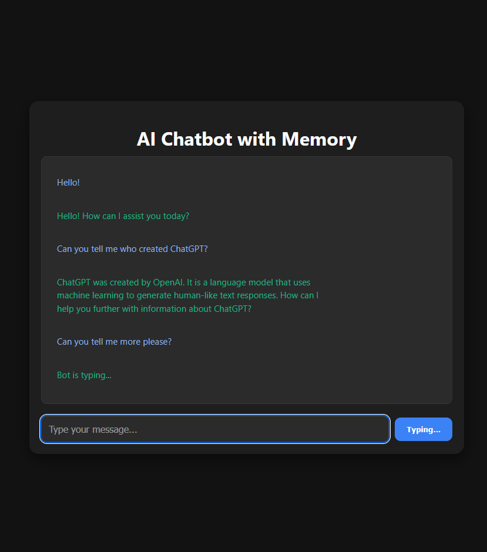

# AI Chatbot with Memory

AI Chatbot with Memory is a full-stack application built with **FastAPI**, **OpenAI**, **LangChain** and **FAISS**.
Each user is assigned a unique session ID, enabling personalized and memory-aware conversations that persist across messages during the session.
 
---
## Contents

- [Features](#features)
- [Tech Stack](#tech-stack)
- [Usage](#usage)
- [How to Install](#how-to-install)
- [License](#license)

---
## Features

- **LLM-Powered Conversations** using OpenAI's GPT (via Langchain)  
- **Vector-Based Memory with FAISS** that retrieves the most relevant messages using semantic similarity (RAG-style)
- **Session-Based Chat Tracking** so multiple users have their own conversations
- **Memory Summarization (LLM-powered)** so the assistant automatically generates summaries of past interactions to preserve memory and reduce token usage.
- Modern Dark-Themed UI with animated typewriter-style assistant replies
- Docker-ready setup for production deployment.

---
## Tech Stack


- **Frontend:** HTML, CSS, Vanilla JavaScript
- **Backend:** Python 3.11, FastAPI, Uvicorn
- **AI & Memory:** LangChain, OpenAI API (gpt-3.5-turbo), FAISS 
- **Others:** Pydantic, Docker, Git

---
## Usage

When a user starts chatting, they are assigned a unique session ID.
The chatbot stores and retrieves past messages for that session, allowing for personalized and memory-aware conversations.
Conversations are enhanced by memory summarization, ensuring that long chats stay sharp without overloading the system.



---
## How to Install 

1. Clone the repository

```bash
git clone https://github.com/idalz/ai-chatbot-with-memory.git
```

2. Create a virtual environment

```bash
python -m venv venv
source venv/bin/activate  # On Windows: venv\Scripts\activate
```

3. Install dependencies  

```bash
pip install -r requirements.txt
```

4. Set up environment variables (root folder)

In a `.env` file:

```
OPENAI_API_KEY=<your-openai-api-key>
```

5. Docker Setup:

Run the following command to build and start the application container:
```bash
docker-compose up --build
```

The application will run at http://localhost:8000

---
## License

This project is licensed under the MIT License.